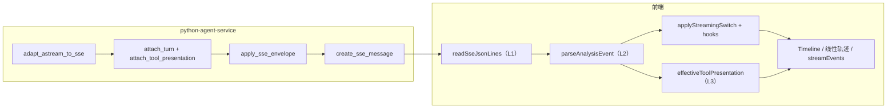

# SSE / Timeline 事件模型（主图 + 子图）

## 目标（摘要）

1. **主/子共用 canonical `type`**，靠 `**scope` + 信封字段**区分来源；合并后禁止再用 `skill_*` 作为主叙事。
2. **UI 可预期**：每类信号在「用户时间线 / 任务看板 / 仅调试」中有归属；同一语义不重复造 `type`。
3. **ReAct 主轴**：优先 `**llm_invoke_*` + `llm_delta`（`channel`: `reasoning`  `text`）** 表达单次 LLM 调用边界与流式 token；兼容旧版 `**reasoning` / `answer`**。其后 `**tool_call` → `tool_result**`；结局 `task_summary` / `conclusion` / `error`；人机 `decision_*` / `parameter_*`。
4. `**tool_call` 展示**：按 `**toolPresentation`**（任务 / 执行 / 状态 / 参数）决定任务看板、线性正文与控件（见第 6 节附录 A）。
5. **扩展**：流程阶段用 `**step`**，是否展示须可判定（见第 7 节附录 B）。

**权威枚举**：`src/types/analysis.ts` 的 `ThinkingEventType`。新增须先改类型与本文档，再改后端/前端。`**toolPresentation` / `parameterControl`** 须在 `AnalysisTimelineEntry`（或等价载荷）与本文档对齐后再实现。

`**turn**`：与 ReAct 周期对齐，见 [SSE_REACT_TURN.md](./Process/history/SSE_REACT_TURN.md)。

**分层设计与实现切片**（L1/L2/L3、SSE 模块、`toolPresentation` 管道、前后端分工）：详见 [analysis-sse-layering / design.md](./Process/analysis-sse-layering/design.md)。

### 端到端：事件生成与消费（简图）

后端将 LangGraph / DeepAgents 流适配为 canonical 事件，经 `data:` 行 JSON 输出；前端按层解码并写入时间线 / 流式状态。下列节点与仓库实现对应（细部见 [design.md](./Process/analysis-sse-layering/design.md)）。

---

## 1. 信封字段（schemaVersion 1）

### 定义

**信封（envelope）指与业务 `type`（如 `reasoning`、`tool_call`）并列的元数据**：描述本条事件在**一次分析流**中的顺序、协议版本、来自主图还是子图、ReAct 轮次等。信封字段**不参与叙事语义**（不描述「发生了什么业务」），只保证 **排序、回放、多子代理分桶、按轮合并 reasoning** 等行为一致。

持久化时，同一批事件写入 `messages.timeline`（`AnalysisTimelineEntry[]`），每条应携带与本节一致的信封字段（允许历史行缺省部分可选字段，前端按默认兼容）。

**与载荷的关系**：`type`、`content`、`toolName` 等为**业务载荷**；下表为**信封**。一条完整事件对象 = 信封字段 + `type` + 类型相关载荷。

### 字段一览

| 字段                 | 含义          | 必填          | 取值 / 类型                 | 备注                                                                          |
| ------------------ | ----------- | ----------- | ----------------------- | --------------------------------------------------------------------------- |
| `schemaVersion`    | 协议版本        | 推荐          | `number`，当前为 `1`        | 未来改版时可区分新旧行                                                                 |
| `seq`              | 流内序号        | **是**（持久化行） | 单调递增非负整数                | 合并主/子 SSE、回放排序的主键之一                                                         |
| `scope`            | 事件归属        | 否（默认主图）     | `'main'` | `'subagent'` | 缺省视为 `main`；子图合并进主流后为 `subagent`                                            |
| `turn`             | ReAct 周期 id | 否           | `number`                | 同轮 `reasoning` / `tool_call` / `tool_result` 应对齐；由后端 `ReactTurnTracker` 等写入 |
| `subagentName`     | 子代理逻辑名      | 条件必填        | `string`                | 当 `scope === 'subagent'` 时**应**设置，用于任务计划分桶；缺省前端可回落 `_default`               |
| `subagentStream`   | 是否子图侧流      | 否           | `boolean`               | 流式事件上常见；与 `scope` 配合，标示来自子图管道                                               |
| `researchSubgraph` | 是否深度研究子图    | 否           | `boolean`               | 可选，用于展示或统计上区分 research 子图                                                   |
| `internal`         | 是否对用户隐藏     | 否           | `boolean`               | `true` 时整条不进入用户时间线（见 `isHiddenFromUserTimeline`）；属信封级展示策略                   |

#### 嵌套委派（可选，schemaVersion 1 扩展，不升主版本）

当主 agent 通过 `task()` 委派子 agent，且子 agent 在允许范围内再次 `task()` 嵌套子 agent（如 `email-security` → `binary-analysis`）时，合并子流事件可携带下列 **可选** 字段，供 UI 在**同一条**时间线内做三级缩进/分组（**主 → 子 → 孙**）。**主图 `scope=main` 行不发送** `delegationDepth`（见下表「省略规则」）；历史时间线若缺省这些字段，前端 **不得推断层级**，保持既有扁平展示。

| 字段 | 含义 | 必填 | 取值 / 类型 | 备注 |
| ---- | ---- | ---- | ----------- | ---- |
| `delegationDepth` | 相对用户本次请求的委派深度（hop） | 条件 | `number` ≥ `1` | `1`：主 agent 顶层 `task(...)` 启动的第一种子 agent；`2`：在某子 agent 内再次 `task(...)` 启动的嵌套子 agent。主图不写。 |
| `rootDelegationId` | 顶层委派锚 id | 条件 | `string` | **等于**主 agent 发出的那条顶层 `task` 的 `tool_call.id`（一次用户任务内并行多封邮件等多段 depth=1 活动靠此区分）。depth≥1 的子流事件 **应** 带上，便于并列顶层委派分段。 |
| `parentToolCallId` | 直接父级 `task` 调用的 id | 条件 | `string` | **仅当** `delegationDepth >= 2`：**等于**父级子 agent 内发起本次嵌套的那条 `task` 的 `tool_call.id`（即启动当前嵌套子图的 `task`）。depth=1 省略。 |

**省略规则（与产品约定一致）**

- **`scope === 'main'`**：不传 `delegationDepth` / `rootDelegationId` / `parentToolCallId`（主图不变）。
- **`delegationDepth === 1`**：传 `delegationDepth`、`rootDelegationId`；不传 `parentToolCallId`。
- **`delegationDepth >= 2`**：三者均传（`rootDelegationId` 仍为同一用户任务下的顶层 `task` id，`parentToolCallId` 为上一层嵌套 `task` id）。

**与既有字段关系**：`subagentName` 仍表示**当前产生事件的子 agent 逻辑名**（如 `email-security`、`binary-analysis`）；嵌套字段描述**在委派树中的位置**，二者同时用于 UI 分组。

**前端兼容（无委派字段的历史行）**：仅具备 `scope=subagent` + `subagentName`、而无上述委派字段时，时间线合并键仍会按 `subagentName` 分段（`delegationStreamKey` 的 legacy 形态），以便在同一子 agent 会话内区分不同逻辑名的流（例如仅有 `subagentName` 差异时的二级 specialist）。

**类型参考**：`src/types/analysis.ts` 中 `AnalysisTimelineEntry` 可选键。

### 任务分桶（`scope` + `subagentName`）

| 规则                       | 说明                                                                                                              |
| ------------------------ | --------------------------------------------------------------------------------------------------------------- |
| 默认 `scope`               | 主图 `main`；经合并子图标记后为 `subagent`（实现：`python-agent-service` 中 `_apply_sse_envelope` / `_tag_merged_subagent_sse`）。 |
| `subagentName`           | `scope === 'subagent'` 时作为任务看板更新桶的键（**目标**：由 `toolPresentation: 'task'` 的 `tool_call` 驱动，不再依赖 `task_plan`）。     |
| 与 `write_todos` / `task` | 主/子任务 id 可能相同，**必须**靠 `scope` + `subagentName` 区分；主图 todo 合成 id 见 `src/hooks/multiAnalyzeStreamEvents.ts`。      |

**类型参考**：`src/types/analysis.ts` 中 `AnalysisTimelineEntry`、`ThinkingEvent`。

---

## 2. 通用信号

主 Agent 与**已合并进主流**的子 Agent **均应使用**下列 `type` 表达叙事与控制；子图不得再定义平行语义类型。

**新流（Python 适配器）**：只下发 `llm_invoke_*` 与 `llm_delta`（`channel`），**不再**下发 `reasoning` / `answer`。合并子流时 `skill_reasoning` → `llm_delta` + `channel: reasoning`。

| `type`               | 定义与说明                                              | 典型载荷                                                                                                                                             | 用户时间线（线性正文）                                                                                                                                          |
| -------------------- | -------------------------------------------------- | ------------------------------------------------------------------------------------------------------------------------------------------------ | ---------------------------------------------------------------------------------------------------------------------------------------------------- |
| `llm_invoke_start`   | 单次 LLM 调用开始（调用前立即发出，用于墙钟计时）                        | `invokeId`（与 `id` 对齐）                                                                                                                            | 不单独占叙事行；前端可用于 Thinking 动画起点                                                                                                                          |
| `llm_delta`          | 单次 LLM 生成的流式片段                                     | `invokeId`、`channel`：`reasoning`（链式思考）或 `text`（用户可见 token）、`content`                                                                             | 同一 `invokeId` 内多段可拼接；`**llm_invoke_end` 结束一块 Thinking**（同 `turn` 也可多块）。**最终收尾 invoke 不发送 `llm_delta(text)`，结论文本由 `task_summary` / `conclusion` 承担。** |
| `llm_invoke_end`     | 单次 LLM 调用结束（成功或错误后发出）；**须在** `tool_call` / 会话边界前闭合 | `invokeId`                                                                                                                                       | 前端 **flush** Thinking 缓冲并可结算本次思考耗时，开始下一块（若仍有后续 delta）                                                                                                |
| `reasoning`          | **仅历史 DB 回放**：旧时间线中的 Think 文本                      | `content`                                                                                                                                        | 与 `llm_delta`+`reasoning` 同展示语义；新流不下发                                                                                                                |
| `answer`             | **仅历史 DB 回放**：旧时间线每轮可见回复（非 `conclusion`）           | `content`；信封同 `reasoning`                                                                                                                        | 新流不下发；不得与 `conclusion` 混义                                                                                                                            |
| `tool_call`          | Act：开始调工具                                          | `toolName`, `toolInput`, `id`, `status?`；`**toolPresentation`**：`task` | `action` | `state` | `parameter`（见第 6 节附录 A）；迁移期可仍带 `stateMutatingOnly` | 依 `**toolPresentation**`：仅 `**action**` / `**parameter**` 在线性正文按规则展示；`**task**` 驱动任务列表、不占「普通工具行」；`**state**` 不展示                                     |
| `tool_result`        | Observe：工具返回                                       | `toolOutput`, `toolName`, `id`                                                                                                                   | 与对应 `tool_call` 的 `**toolPresentation**` 一致；`**state**` 隐藏；`**task**` 以任务 UI 为准                                                                      |
| `task_summary`       | 单次任务**执行摘要**（如 `## SM_TASK_DIGEST`）                | `summary` 等                                                                                                                                      | 左侧摘要区 / 置底，非正文长文                                                                                                                                     |
| `conclusion`         | **完整用户结果**（最终回答/报告）                                | `content`                                                                                                                                        | 通常右侧文档区，非左侧线性正文                                                                                                                                      |
| `error`              | 可展示错误                                              | `detail`, `status?`                                                                                                                              | 展示                                                                                                                                                   |
| `decision_request`   | 请用户做选择（HITL 等）                                     | 见 HITL 文档                                                                                                                                        | 展示（交互区）                                                                                                                                              |
| `decision_response`  | 用户已选择                                              | 同上                                                                                                                                               | 可展示为简短确认                                                                                                                                             |
| `parameter_request`  | 请用户填参数                                             | 见参数收集实现                                                                                                                                          | 展示（表单）                                                                                                                                               |
| `parameter_response` | 用户已提交参数                                            | 同上                                                                                                                                               | 可展示为简短确认                                                                                                                                             |
| `done`               | **流结束**（控制面，非叙事）                                   | 可含 `awaitingHuman`、`hitl`                                                                                                                        | 不进入推理正文                                                                                                                                              |
| `step`               | 阶段/里程碑（非 token）                                    | `label`, `status`, `detail`；可见性见第 7 节附录 B                                                                                                        | 默认展示；`internal`/`debug`/`visibility` 隐藏                                                                                                              |

---

## 3. 不通用信号

**仅主图编排、任务 UI、工作流 SOP 或未合并子流**使用；子图合并后**不应**依赖下列类型承载核心 ReAct（应映射到第 2 节「通用信号」）。

| `type`            | 定义与说明               | 典型载荷                 | 用户时间线（线性正文）                                                                                                                                                         |
| ----------------- | ------------------- | -------------------- | ------------------------------------------------------------------------------------------------------------------------------------------------------------------- |
| `task_create`     | 任务列表新增              | `task`, `taskStatus` | 任务面板为主                                                                                                                                                              |
| `task_update`     | 任务列表更新              | 同上                   | 任务面板为主                                                                                                                                                              |
| `task_plan`       | （**待废弃**）规划结构       | `plan`               | **DeepAgents 主适配器已不再发送**；任务列表由 `**tool_call` `write_todos`** + `**toolPresentation: 'task'**` 驱动；`TaskExecutor.execute_plan_stream` 等旧路径仍可发 `task_plan`；迁移期前端可仍兼容简行 |
| `plan_complete`   | 规划阶段结束              | —                    | 通常不占正文一行                                                                                                                                                            |
| `task_start`      | 执行器开始某一任务           | `taskId`, …          | **默认不展示**于线性正文                                                                                                                                                      |
| `task_step`       | 执行器步骤进度             | `taskId`, `step`, …  | **默认不展示**                                                                                                                                                           |
| `task_complete`   | 执行器任务完成             | `taskId`, …          | **默认不展示**                                                                                                                                                           |
| `task_error`      | 执行器任务失败             | `taskId`, …          | **默认不展示**                                                                                                                                                           |
| `next_actions`    | 后续建议操作              | `nextActions`        | 可展示                                                                                                                                                                 |
| `workflow_step`   | SKILL.md 工作流步骤（SOP） | `step`               | 按产品；与 `task_step` 不同                                                                                                                                                |
| `skill_start`     | 子图**未合并**时的阶段起      | —                    | 独立子流；合并后应映射为 `step`                                                                                                                                                 |
| `skill_complete`  | 子图**未合并**时的阶段止      | —                    | 同上                                                                                                                                                                  |
| `skill_reasoning` | 子图**未合并**时的推理       | `content`            | 合并进主流 → `llm_delta` + `channel: reasoning`                                                                                                                          |
| `skill_error`     | 子图**未合并**时的错误       | `detail`             | 合并后 → `error`                                                                                                                                                       |

`**skill_*` 并入主 SSE 映射**

| 原子图类型                            | 并入后 canonical                           |
| -------------------------------- | --------------------------------------- |
| `skill_reasoning`                | `llm_delta`（`channel: reasoning`）       |
| `skill_error`                    | `error`                                 |
| `skill_start` / `skill_complete` | `step`（建议 `visibility`/`internal` 避免刷屏） |

---

## 4. 测试与调试信号

**不进入用户时间线**（`isHiddenFromUserTimeline`）；用于开发诊断、原始 SSE 日志、开发者面板。仓库**未**单独定义 `type: test`；自动化测试通过快照完整 `timeline` 或 SSE 行比对即可。

| `type` / 标记      | 定义与说明            | 典型载荷 | 用户时间线  |
| ---------------- | ---------------- | ---- | ------ |
| `debug`          | 诊断事件，仅开发者面板 / 日志 | 任意   | **隐藏** |
| `internal`       | 内部事件类型           | 任意   | **隐藏** |
| `internal: true` | 任意 `type` 上的隐藏标记 | —    | **隐藏** |

实现：`src/lib/timelineDisplay.ts`。生产可不挂载开发者面板。

---

## 5. 待收敛信号

下列类型**仍存在或曾存在**，与第 2 节「通用信号」有重叠或语义不清；新功能**不应依赖**其长期形态，应逐步合并或替换。

| `type` / 名称                         | 现状说明                                 | 收敛方向                                                                                                                                                                            |
| ----------------------------------- | ------------------------------------ | ------------------------------------------------------------------------------------------------------------------------------------------------------------------------------- |
| `warning`                           | 后端少数路径发出，非 `ThinkingEventType` 核心叙事  | 合并为 `error` + `severity: 'warning'`，或仅日志 + `internal`                                                                                                                           |
| `**understanding`**                 | **已废弃**；历史流与持久化行仍可能存在                | **停发**：意图/输入摘要改由 `**reasoning`**（`content`，如首条或独立 `turn`）或 `**step**`（阶段标签）表达；缺参、选项交互用 `**parameter_request**` / `**decision_request**`；迁移期前端可继续解析旧 `understanding` 载荷直至类型从协议移除 |
| `research_clarification_required`   | 仅 open_deep_research **original** 路径 | 与 `decision_request` / `parameter_request` 统一                                                                                                                                   |
| `skill_*`（主路径）                      | 合并子流后仍偶发                             | 新代码禁止作为主路径；一律映射第 3 节中的 `**skill_*` 并入主 SSE 映射**表                                                                                                                                |
| `classification` / `subagent_spawn` | 已移除                                  | 意图 → `**reasoning`** / `**step**`（见上行 `**understanding**` 收敛）；委派 → `tool_call` + `**toolPresentation: 'task'**`（`toolName === 'task'`）+ `scope`                                 |
| `task_plan`（重复列出）                   | 见第 3 节                               | **收敛**：停发独立 `task_plan`；任务列表仅由 `**task` 类 `tool_call`**（含 `write_todos`）驱动                                                                                                      |
| `state_update`（deep research）       | 已移除                                  | 由 `step` + `reasoning` + `tool_*` + `conclusion` 替代                                                                                                                             |

---

## 6. 附录 A：`tool_call` 展示语义（`toolPresentation`）

每条 `**tool_call` / 配对 `tool_result**` 应携带展示语义字段（建议名 `**toolPresentation**`，枚举如下）。前端**优先根据该字段**决定任务看板、线性正文与参数控件；**不再依赖**按 `toolName` 硬编码的 allowlist（迁移期可保留兜底）。

### 配置来源（热配置）

- 工具展示与输出策略统一由 `python-agent-service/config/tool_presentation.yaml` 定义。
- 后端加载器：`python-agent-service/app/sse/tool_presentation.py`。
- 生效方式：按文件 `mtime` 热加载；修改 YAML 后新 SSE 事件自动使用新规则（无需重启服务）。
- 字段：
  - `presentation`: `task` | `action` | `state` | `parameter`
  - `parameter_control`（可选）: `single` | `multi` | `fill`
  - `emit_output`: `true` | `false`（控制 `tool_result.toolOutput` 是否发送到 SSE）

| `toolPresentation` | 含义（产品）                         | 典型 `toolName` / 载荷                                    | 任务看板                                               | 线性正文（ReAct 主轴）               |
| ------------------ | ------------------------------ | ----------------------------------------------------- | -------------------------------------------------- | ---------------------------- |
| `**task`**         | **任务属性**：委派子代理或更新待办列表          | `**task`**（委派）；`**write_todos**`（待办项、勾选状态等，载荷即任务列表语义） | **是**——根据本条更新任务列表状态（与 `scope` + `subagentName` 分桶） | **否**（不占「普通工具调用」行；避免与任务面板重复） |
| `**action`**       | **执行工具属性**：有可观测的执行/读写含义，应对用户可见 | `read_file`、`grep`、`edit_file`、`execute` 等            | 否                                                  | **是**——按现有工具行/折叠区展示          |
| `**state`**        | **仅更新状态**：内部状态变更，无独立叙事价值       | 如部分 middleware 工具、纯记账类调用                              | 否                                                  | **否**；配对 `tool_result` 同步隐藏  |
| `**parameter`**    | **输入参数工具**：需用户输入以继续            | 依产品定义的参数收集工具                                          | 否                                                  | **是**——按控件类型展示（见下表）          |

### `parameter` 子类型（建议字段 `**parameterControl`**）

| `parameterControl` | 含义        | 前端控件              |
| ------------------ | --------- | ----------------- |
| `**single**`       | 单选        | 单选组（radio）        |
| `**multi**`        | 多选        | 多选组（checkbox 列表等） |
| `**fill**`         | 填空 / 自由输入 | 文本框、多行输入等         |

若参数收集已用独立类型 `**parameter_request**` / `**decision_request**`（第 2 节），与之的边界由产品约定：**流内 `tool_call` 带 `parameter`** 表示模型侧「以工具形态发起参数步骤」；**独立 `type`** 表示编排层显式人机交互。两者不应重复描述同一用户动作。

### 与 `task_plan`、生命周期事件的关系（目标架构）

- **后端**：不再发送 `**task_plan`**；待办/勾选结构随 `**toolPresentation: 'task'**` 的 `tool_call`（尤其 `**write_todos**`）一并到达。
- **SSE 输出**：若 YAML 中某工具 `emit_output: false`（例如 `read_file`），仍发送 `tool_result` 事件，但 `toolOutput` 为空字符串，用于降低流量和前端内存占用。
- **前端**：任务列表 UI **仅订阅** `task` 类 `tool_call`（及配对 `tool_result` 若需同步状态）；迁移期若仍收到历史 `**task_plan`**，可继续兼容直至后端下线。
- `**task_start` / `task_complete` / `task_step` / `task_error**`（第 3 节）：仍可表示执行器粒度进度；**默认不进线性正文**，与 `**task` 类 `tool_call`** 分工不变（列表 vs 执行器状态）。

### 迁移与兼容

| 方式                                       | 说明                                                                                  |
| ---------------------------------------- | ----------------------------------------------------------------------------------- |
| `**toolPresentation: 'state'**`          | 与既有 `**stateMutatingOnly: true**` 语义对齐；新代码应写 `**toolPresentation**`，旧字段可在适配层互转直至移除。 |
| `**internal: true**`（信封）                 | 整条不进入用户时间线；与 `**state**` 正交——可先标 `internal` 再逐步细化为 `toolPresentation`。              |
| 前端按 `toolName` 特例（如历史 `**write_todos**`） | 迁移期兜底；收敛后应以 `**toolPresentation**` 为准。                                              |

---

## 7. 附录 B：`step` 可见性

| 条件                                                                     | 用户时间线 |
| ---------------------------------------------------------------------- | ----- |
| 默认（无 `internal`、非 `debug`、`visibility` 未设为 debug/internal）             | 展示    |
| `internal: true` 或 `type: debug` 或 `visibility` 为 `debug` / `internal` | 不展示   |

`visibility` 为建议字段；未进 TS 前可用 `internal` / `debug` 表达。

---

## 8. Open Deep Research（遵守第 2 节通用信号与 `step`）

- 实现：`open_deep_research_compiled.py` 的 `_extract_stream_events` 等。
- 使用第 2 节所列 `reasoning` / `tool_call` / `tool_result`；不发 `SystemMessage` 到用户可见 `step`；不发 `state_update`。
- **合并进主 SSE 的 compiled 子图**不发送 `**conclusion`** / `**done**`：最终成文与流结束由**主 Agent**（`task` 工具返回 + 主图适配器）统一产出，避免双子图结论与双重 `done`。
- `**step` 阶段（固定四档，产品可配置 UI）**：每条为**用户可见**里程碑（无 `internal` / `visibility: debug`），按顺序补齐至 4 条；载荷带 `**subagentName: 'deep-research'`**、`**researchSubgraph: true**`，便于合并后 id 与任务分桶一致：
  - `phaseId`: `deep_research_clarify` | `deep_research_plan` | `deep_research_collect` | `deep_research_report`
  - `phaseIndex`: `0`–`3`
  - `label`: 来自 `config/LABELS.md`（`research_sse_phase_clarify` / `research_sse_phase_brief` / `research_sse_phase_collect` / `research_sse_phase_final`）
  - `status`: 已进入该阶段为 `**running**`；流结束前从未进入的阶段补发 `**skipped**`（`id` 后缀 `-skipped`）
  - `id`: `dr-phase-{phaseId}` 或 `dr-phase-{phaseId}-skipped`
- **调试用 `step`（后续可删流）**：图节点粒度 `debug-node-{node}`、人类输入摘要 `debug-input-*` 等，带 `**visibility: debug`** 与 `**internal: true**`，附录 B 规则下**不进入用户时间线**。
- 编排类工具 `**think_tool`**、`**ConductResearch**`、`**ResearchComplete**`：注册表固定 `**toolPresentation: 'state'**`（不进入线性工具正文；与 `stateMutatingOnly` 互转见附录 A 迁移表）。

---

## 9. 持久化与回放

`timeline` 存 canonical 行（含 `schemaVersion`, `seq`, `scope`, `turn`）。**目标**：`tool_call` / `tool_result` 行持久化 `**toolPresentation`**（及 `**parameterControl**`，当为 `parameter` 时），以便回放与前端一致。

---

## 10. 主界面：ReAct 线性视图（`ReactLinearTraceView`）

| 区域              | 内容                                                                                                                                                                                                                                                                                                                                                                     |
| --------------- | ---------------------------------------------------------------------------------------------------------------------------------------------------------------------------------------------------------------------------------------------------------------------------------------------------------------------------------------------------------------------- |
| **body**        | `reasoning`；`**tool_call` / `tool_result`**：仅 `**toolPresentation: 'action'**` 与 `**'parameter'**` 进入正文（`**parameter**` 按 `**parameterControl**` 渲染控件）；`**'task'**`、`**'state'**` 不占线性工具行。`**task_plan**`：迁移期可仍显示简行，后端停发后删除兼容分支。`**step**`（尊重第 7 节附录 B）。`**understanding**`：已废弃，见第 5 节；勿再写入正文策略。`**task_start` / `task_complete` / `task_error` / `task_step**` 默认不展示。 |
| **任务看板**        | 由 `**toolPresentation: 'task'`** 的 `tool_call`（`**task**`、`**write_todos**` 等）驱动；与 `**scope` + `subagentName**` 分桶（第 1 节）。                                                                                                                                                                                                                                             |
| **summary（置底）** | 仅 `task_summary`（及 props `taskSummary`）；**不**放 `conclusion`。                                                                                                                                                                                                                                                                                                           |

合并展示：`buildUnifiedTimelineItems`（`hideLinearTraceBody`）避免与正文重复。实现收敛后，隐藏逻辑以 `**toolPresentation`** 为准，而非按 `toolName` 硬编码列表。

---

## 11. 维护约定

1. `**src/types/analysis.ts` → 本文档 → 后端 → 前端**。
2. 新增/变更工具时：在后端为 `tool_call` 写入 `**toolPresentation`**（及 `**parameterControl**`）；前端 `**isHiddenFromUserTimeline` / `buildReactLinearRows**` 与任务面板订阅逻辑与之对齐。
3. `**stateMutatingOnly**` 与 `**step.visibility**`：与 `**toolPresentation: 'state'**` / 附录 B 并行期间可做适配层互转，移除重复判断后只保留一端。

