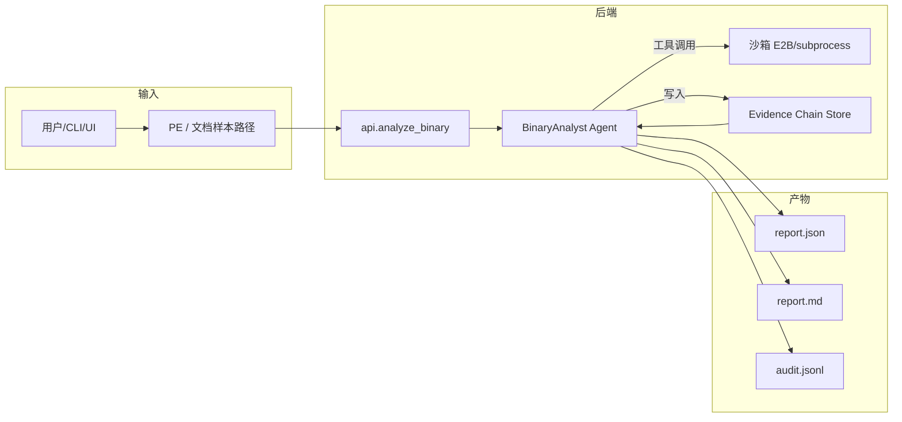
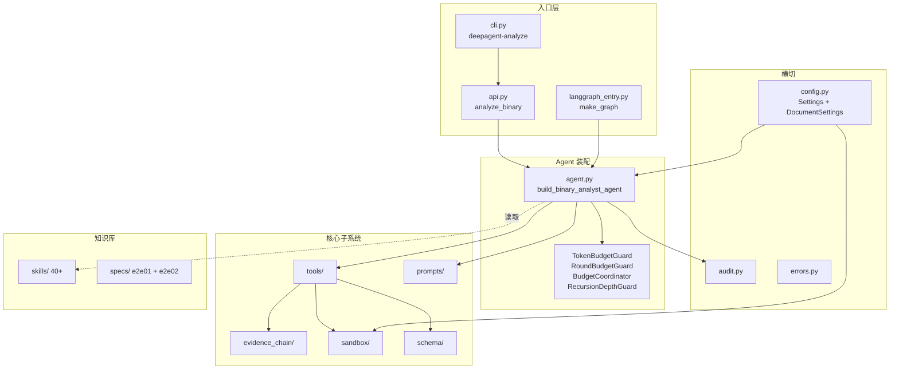
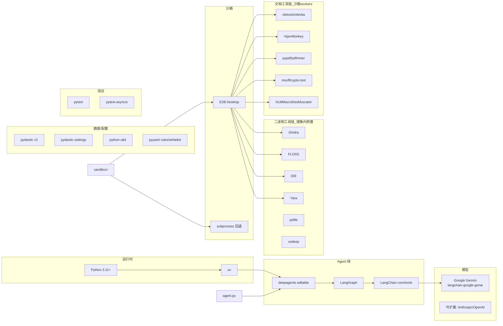
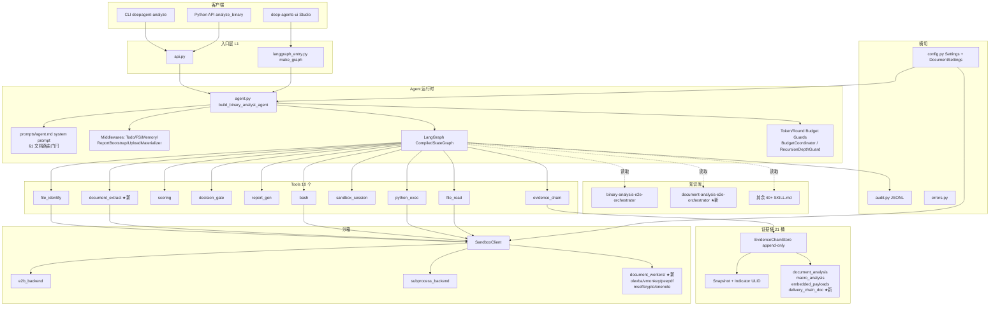
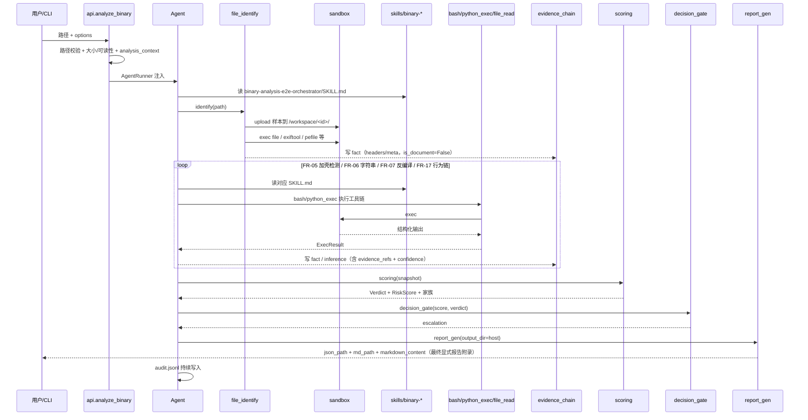
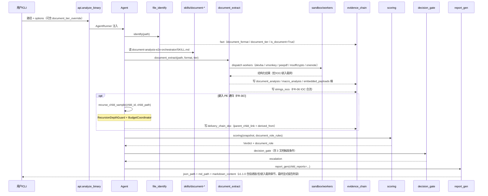
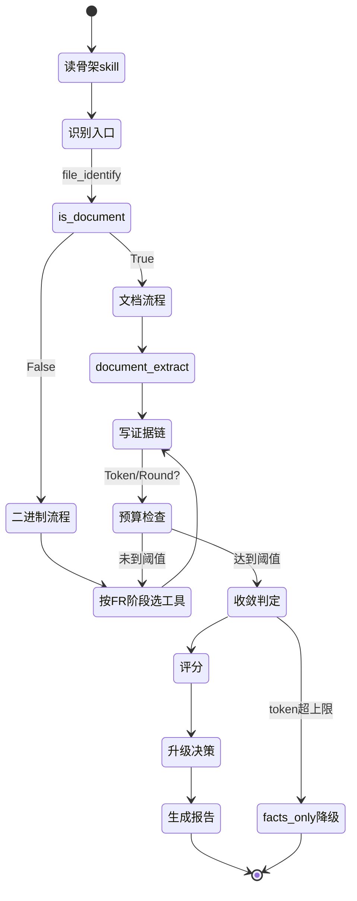
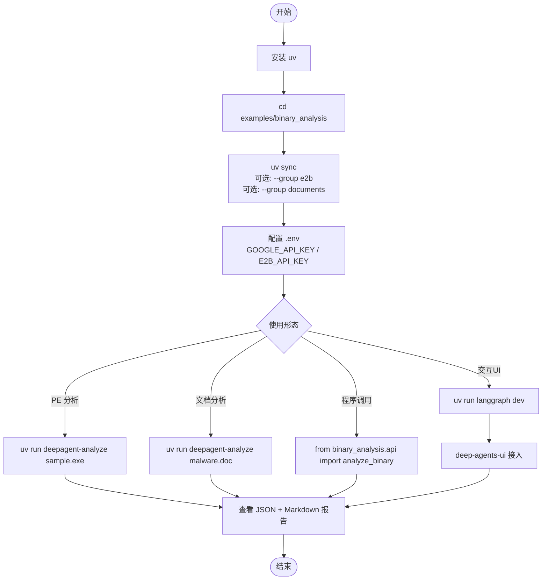
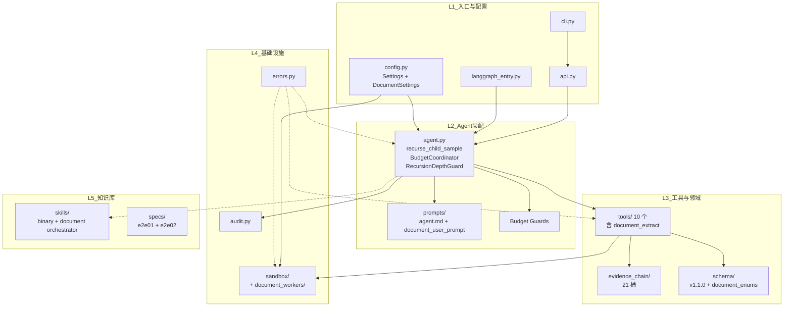

# Binary Analysis 项目梳理与图示

本文档梳理 `examples/binary_analysis` 的核心文件、目录结构、关键模块与运行路径，作为架构快照供人类和 AI Agent 快速建立全局认知。

> **文件定位**：架构级别的"项目身份卡"，更新频率为**季度**。功能需求见 `specs/`；执行进度见各切片的 `IMPL-PROGRESS.md`；运行时 Agent system prompt 见 `prompts/agent.md`。

## 🧭 阅读导航（Agent 与贡献者请先看这里）

**不要默认全文阅读本文件（650+ 行）。** 按需读取：

| 任务类型 | 建议阅读范围 | 定位方式 |
| --- | --- | --- |
| 日常 bug 修复 / 单文件小改 | §1 项目用途 + §2 目录结构 | `Grep "^## 1\. \|^## 2\."` 后 `Read` 各段 |
| 加新 Tool / 改公共接口 | §1 + §3（核心文件职责）+ §5 系统架构 | `Grep "^## [135]\. "` 定位 |
| 排查运行时行为 | §5 架构 + §6 时序 + §7 运行形态 | `Grep "^## [567]\. "` |
| 对齐配置 / 环境变量 | §8 环境变量速查（约 20 行） | `Grep "^## 8\. "` |
| 按层理解模块职责 | §9 模块职责 | `Grep "^## 9\. "` |
| 架构红线 / 硬约束 | **不在此文件**，见 `.cursor/rules/50-binary-analysis.mdc`（24 行） | 直接读该 mdc |
| 功能需求细节（FR / NFR / ADR） | **不在此文件**，见 `specs/e2e01-backend/SPEC.md` 或 `specs/e2e02-documents/SPEC.md` 对应章节 | 用 `Grep` 按编号精读 |

> 行号随版本漂移；优先用 `Grep` 按标题锚点定位，再用 `Read` 的 `offset` / `limit` 精读目标段落。

> Agent 节流原则：本文件聚焦"**项目长什么样**"；spec 负责"**要实现什么**"；mdc 负责"**不能违反什么**"。三者职责不重叠，按需分别读，**勿合并全读**。

---

## 1. 项目用途

Binary Analysis 是一个基于 **DeepAgents + LangGraph** 的**恶意软件静态分析后端 Agent**，覆盖两类样本：

- **E2E-01（二进制）**：给定 PE（可扩展到 ELF / Mach-O）样本，调用文件识别、反编译、字符串/IOC 提取、行为链重建、证据链聚合、评分、决策门、报告生成等工具，零执行产出 JSON + Markdown 分析报告。
- **E2E-02（文档）**：给定 Office（OOXML/OLE2）、PDF、RTF、OneNote、HTA 等文档样本，在同一单 Agent 架构下，通过 `document_extract` Tool 提取宏/嵌入脚本/IOC，可递归分析嵌入 PE 载荷（FR-30），产出 Schema v1.1.0 报告（含投递链/宏分析/嵌入载荷章节）。

两类分析共享同一 Agent 实例、同一证据链子系统和同一评分/报告管线，由 `file_identify` 的 `is_document` 标志在第一阶段分流。



硬边界（架构红线，见 `.cursor/rules/50-binary-analysis.mdc` 与 SPEC 的 ADR）：

- **ADR-05 / NFR-04 零执行**：样本字节**永不在宿主机执行**，所有命令经 `SandboxClient.exec`。
- **NFR-03 二进制隔离**：样本 bytes 仅经 `SandboxClient.upload` 进入 `/workspace/<analysis_id>/`；LLM 请求体与 Tool 返回值**不得包含原始字节**。
- **FR-09 / ADR-02 证据链 append-only**：`EvidenceChainStore` 禁止 `update/delete`。
- **ADR-03 fact vs inference**：工具观察 `kind=fact`；LLM 结论 `kind=inference` 必须带 `evidence_refs` + 置信度。
- **ADR-04 规则引擎为主**：Verdict 与 Risk Score 由 `ScoringTool` 产出，LLM 仅作旁证。
- **ADR-DOC-01 文档工具 Sandbox-only**：ViperMonkey / olevba 等解释器**仅在沙箱 worker 内运行**，宿主不得 import。
- **ADR-DOC-10 单 Agent**：无独立 DocumentAnalyst / Router 子 Agent；`document_extract` 注册为第 10 个 Tool，与 `bash` 互斥使用。

---

## 2. 目录结构

```
examples/binary_analysis/
├── langgraph.json                       # LangGraph 服务配置（graph → langgraph_entry.make_graph）
├── langgraph_entry.py                   # langgraph dev / deep-agents-ui 入口：每 thread 一个子图
├── pyproject.toml                       # 依赖（deepagents / pydantic / langchain-google-genai / e2b 可选组 / documents 可选组）
├── uv.lock                              # 依赖锁
├── .env / .env.example                  # API key 与开关（BINARY_ANALYSIS_USE_E2B 等）
├── PROJECT_OVERVIEW.md                  # 本文件：架构快照
│
├── config/                              # 运行期配置
│   ├── bash_whitelist.yaml              # bash 工具允许的命令白名单（ADR-13 守卫）
│   └── scoring_rules.yaml               # 规则引擎 v1.1.0：binary: + document: namespace；Verdict 阈值 / 风险权重 / 9 文档规则 / document_role_rules
│
├── specs/                               # 规格文档（需求层）
│   ├── SPEC.md                          # v0.7 产品全貌（全形态/多格式；长生命周期）
│   ├── e2e01-backend/                   # E2E-01 切片：PE 静态分析后端
│   │   ├── SPEC.md                      # 切片 SPEC（12 FR）
│   │   ├── DESIGN.md                    # ADR + 组件设计（ADR-01..ADR-17）
│   │   ├── IMPL-PLAYBOOK.md             # 分批次实施手册
│   │   └── IMPL-PROGRESS.md             # 跨会话执行进度（日更）
│   └── e2e02-documents/                 # E2E-02 切片：文档恶意软件分析（C1~F1 已交付）
│       ├── SPEC.md                      # 切片 SPEC（14 FR：FR-03/08/13ext/14ext/15ext/30 + FR-DOC-*）
│       ├── DESIGN.md                    # ADR-DOC-01..10 + 组件详设
│       ├── IMPL-GUIDE.md                # 实现指引（组件级别）
│       ├── IMPL-PLAYBOOK.md             # 分批次实施手册（G/C1~C13/P1/F1/S/F-manual/R）
│       └── IMPL-PROGRESS.md             # 跨会话执行进度（日更，C1~F1 已过门）
│
├── e2b-templates/binary_analysis/       # E2B 沙箱镜像构建脚本（ADR-16 / ADR-17）
│   ├── template.py                      # 镜像内预置工具（Ghidra / FLOSS / DIE / yara …）
│   ├── build_prod.py / build_dev.py     # 生产 / 开发镜像构建
│   ├── DecompileByList.py               # Ghidra 批量反编译脚本（镜像内）
│   └── README.md                        # E2B 镜像说明
│
├── skills/                              # 扁平化的静态分析技能（ADR-14 / ADR-15）
│   ├── binary-analysis-e2e-orchestrator/SKILL.md    # 二进制主编排骨架（必读，含文档 tier 分流说明）
│   ├── binary-analysis-e2e-orchestrator/SKILL_cn.md # 中文镜像
│   ├── document-analysis-e2e-orchestrator/SKILL.md  # 文档主编排骨架（E2E-02 必读）
│   ├── document-analysis-e2e-orchestrator/SKILL_cn.md
│   ├── binary-analysis-evidence-chain-protocol/
│   ├── binary-analysis-sanitize-untrusted-strings/
│   ├── analyzing-linux-elf-malware/
│   ├── detecting-process-hollowing-technique/
│   ├── extracting-iocs-from-malware-samples/
│   ├── ...（共 40+ 个工作流）
│   └── CHANGELOG.md                     # skill 改动与上游同步的可选审计日志（v0.7 起推荐，非强制）
│
├── agent.py                             # C14：Agent 装配 + Token/Round 预算守卫 + BudgetCoordinator + RecursionDepthGuard + recurse_child_sample
├── api.py                               # L1 入口：analyze_binary() 公共 Python API（支持 document_tier_override / max_recursion_depth 参数）
├── cli.py                               # 控制台入口：deepagent-analyze（新增 --token-budget / --max-rounds / --max-recursion-depth / --document-tier-override）
├── config.py                            # pydantic-settings：Settings（e2e01）+ DocumentSettings（e2e02，env_prefix="DEEPAGENT_"）
├── audit.py                             # <analysis_id>.audit.jsonl 记录（NFR-06）
├── errors.py                            # 全部领域异常（含 BudgetExceeded.reason 字段）
├── langgraph_entry.py                   # `langgraph dev` / deep-agents-ui：`make_graph`
├── report_bootstrap.py                  # Middleware：向 Agent 注入 host/sandbox 边界提示
├── ui_backend.py                        # deep-agents-ui 上传状态后端
├── upload_materializer.py               # Middleware：将 UI 上传物化到沙箱
│
├── prompts/                             # 运行时 System Prompt
│   ├── agent.md                         # BinaryAnalyst 角色 + 硬约束（英文）
│   ├── agent_cn.md                      # 中文镜像
│   ├── system_prompt.py                 # 加载 agent.md（整文一次 str.format）；DEFAULT_TOKEN_BUDGET / DOC_DEFAULT_TOKEN_BUDGET / TOKEN_BUDGET_HARD_CAP / BINARY_ANALYST_SYSTEM_PROMPT
│   ├── sanitize.py                      # 样本派生字符串消毒（ADR-08 / NFR-10）；含文档元数据消毒 / VBA 截断 / PDF 解码串入口
│   └── document_user_prompt.py          # render_document_user_prompt 纯函数（文档模式初始用户提示）
│
├── schema/                              # Pydantic v2 数据模型（Schema v1.1.0）
│   ├── indicator.py                     # Indicator / confidence / fact-vs-inference
│   ├── evidence_chain.py                # 证据链快照（21 桶，含 4 文档桶）
│   ├── report.py                        # ReportV1（schema SemVer 1.1.0，+9 Optional 文档字段，+3 Markdown 章节）
│   ├── document_enums.py                # DocumentFormat×11 / DocumentTier×3 / DocumentRole×4 / UnknownDowngradeReason×6
│   └── indicator_types_v1_1.py          # 4 frozenset：DOC_ANALYSIS_TYPES / MACRO_ANALYSIS_TYPES / EMBEDDED_PAYLOADS_TYPES / DELIVERY_CHAIN_DOC_TYPES
│
├── evidence_chain/                      # 证据链子系统
│   ├── store.py                         # append-only 存储（ULID Indicator.id）；4 文档桶枚举校验门卫
│   └── tool.py                          # EvidenceChainTool（FR-09）
│
├── sandbox/                             # 沙箱抽象与后端
│   ├── client.py                        # SandboxClient Protocol / ExecResult
│   ├── e2b_backend.py                   # E2B 生产后端（ADR-17）
│   ├── subprocess_backend.py            # 本地 subprocess 回退（ADR-16）
│   ├── registry.py                      # 每 analysis_id 的会话注册
│   ├── session_tool.py                  # Agent 可调用的生命周期 Tool
│   └── document_workers/                # 沙箱内文档解析 worker（ADR-DOC-01，宿主禁止 import）
│       ├── run_olevba.py                # OLE/OOXML VBA + XL4 + 宏触发器 + 远程模板
│       ├── run_vmonkey.py               # ViperMonkey VBA 仿真（Tier A/P0）
│       ├── run_peepdf.py                # PDF 对象树 / JS / 触发器
│       ├── run_msoffcrypto.py           # 加密 Office 密码字典解密
│       └── run_onenote.py               # OneNote 节/附件提取
│
├── tools/                               # 10 Agent Tool（ADR-13 + ADR-DOC-04）
│   ├── file_identify.py                 # FR-01/02：格式识别 + 元数据；文档格式分支（11 种 + Polyglot）
│   ├── document_extract.py              # FR-03：DocExtractTool；多格式调度 5 workers；3 桶写入；加密解密；IOC 合流
│   ├── scoring.py                       # FR-13：规则引擎（binary: + document: namespace）；document_role 确定性输出
│   ├── decision_gate.py                 # FR-14：升级决策（+3 条文档触发条件）
│   ├── report_gen.py                    # FR-15：ReportV1 v1.1.0 双格式渲染（+3 文档章节 + child_reports 递归链接 + markdown_content）
│   ├── bash_tool.py                     # 原始 bash（白名单守卫）
│   ├── python_exec_tool.py              # 原始 Python exec
│   └── file_read_tool.py                # 沙箱文件读取
│
├── tests/
│   ├── unit_tests/                      # 无网络，覆盖每个模块（909 passed）
│   ├── integration_tests/               # 允许网络/沙箱（35 passed）
│   │   ├── test_e2e02_recursion_budget.py   # FR-30 递归深度 + 预算耗尽（4 tests）
│   │   └── test_orchestrator_skill_routing.py  # Orchestrator skill 互斥路由（28 tests）
│   └── fixtures/                        # 样本夹具（binaries/、json 参考）
│
├── fmanual-runs/                        # F-manual 手动 E2E 执行痕迹
└── logs/                                # 本地运行日志
```



---

## 3. 核心文件职责

| 文件 | 职责 |
|------|------|
| `api.py` | L1 公共 Python API：路径校验（IR-08）、大小守卫、AgentRunner 注入、生命周期上下文（`analysis_context`）；新增 `document_tier_override` / `max_recursion_depth` 参数 |
| `cli.py` | `deepagent-analyze` 控制台入口；**延迟导入 deepagents / LangChain**；新增 `--token-budget` / `--max-rounds` / `--max-recursion-depth` / `--document-tier-override` 参数 |
| `agent.py` | **Agent 装配核心**：组装 10 Tool 列表、系统 prompt、中间件；实现 Token / Round / RecursionDepthGuard 守卫；`BudgetCoordinator` 保子砍父策略；`recurse_child_sample` 嵌入 PE 递归分析 |
| `langgraph_entry.py` | `langgraph dev` / deep-agents-ui 入口：每 `thread_id` 一个 `CompiledStateGraph`，独立 `EvidenceChainStore` 实例；`analysis_id` = `thread_id` |
| `config.py` | `Settings`（pydantic-settings，e2e01）+ `DocumentSettings`（`env_prefix="DEEPAGENT_"`，e2e02）：阈值、token/轮次上限、沙箱后端开关等 |
| `audit.py` | `<analysis_id>.audit.jsonl` 写入（NFR-06）；`contextvars` 贯通 `analysis_id`；提供 `log_tool_call / log_llm_request / log_sandbox_lifecycle / log_indicator_write / log_skill_read` |
| `errors.py` | 全部领域异常；`BudgetExceeded` 新增 `reason` 字段（`recursion_budget` / `token` / `round`）；决定 CLI 退出码 |
| `prompts/agent.md` | BinaryAnalyst 运行时 system prompt；定义"零委托"、"零样本字节"、"fact vs inference"等硬约束 |
| `prompts/system_prompt.py` | 加载 `agent.md`（整文一次 `str.format`，五占位）；导出 `DEFAULT_TOKEN_BUDGET=50_000` / `DOC_DEFAULT_TOKEN_BUDGET=80_000` / `TOKEN_BUDGET_HARD_CAP=120_000` / `BINARY_ANALYST_SYSTEM_PROMPT`（文档路由门闩已并入 §1，原 `DOCUMENT_MODE_PROMPT_PATCH` 切分已废） |
| `prompts/sanitize.py` | 样本派生字符串消毒（ADR-08 / NFR-10）；`DOCUMENT_METADATA_FIELDS` / `sanitize_document_metadata_map` / `truncate_vba_source` / `sanitize_pdf_decoded_string` |
| `prompts/document_user_prompt.py` | `render_document_user_prompt` 纯函数：文档模式初始用户提示，含文档格式/tier 上下文注入 |
| `schema/indicator.py` | `Indicator` / confidence / fact-vs-inference |
| `schema/evidence_chain.py` | 证据链快照：**21 桶**（17 e2e01 + 4 文档桶：`document_analysis / macro_analysis / embedded_payloads / delivery_chain_doc`） |
| `schema/report.py` | `ReportV1`（**schema SemVer 1.1.0**）；+9 Optional 文档字段；+3 Markdown 章节 key（`delivery_chain / macro_and_embedded_script / embedded_payloads_list`） |
| `schema/document_enums.py` | `DocumentFormat`×11 / `DocumentTier`×3（P0/P1/P2）/ `DocumentRole`×4 / `UnknownDowngradeReason`×6 |
| `schema/indicator_types_v1_1.py` | 4 frozenset：`DOC_ANALYSIS_TYPES / MACRO_ANALYSIS_TYPES / EMBEDDED_PAYLOADS_TYPES / DELIVERY_CHAIN_DOC_TYPES` + `ALL_DOC_INDICATOR_TYPES` |
| `evidence_chain/store.py` | append-only 存储；ULID 作为 Indicator.id；禁止 update/delete；4 文档桶 `indicator_type` 枚举门卫（C2） |
| `evidence_chain/tool.py` | Agent 可用的 `evidence_chain` Tool（FR-09） |
| `sandbox/client.py` | `SandboxClient` Protocol + `ExecResult`；工厂与工具函数 |
| `sandbox/e2b_backend.py` | E2B 沙箱后端（生产默认） |
| `sandbox/subprocess_backend.py` | 本地 subprocess 回退（ADR-16）；开发/CI |
| `sandbox/document_workers/run_olevba.py` | **沙箱内** OLE/OOXML VBA 项目树、宏触发器、远程模板、DDE、XL4 提取（ADR-DOC-01） |
| `sandbox/document_workers/run_vmonkey.py` | **沙箱内** ViperMonkey VBA 仿真（Tier A/P0）；宿主禁止 import |
| `sandbox/document_workers/run_peepdf.py` | **沙箱内** PDF 对象树 / JS 触发器 / XFA 表单 / 压缩流解码 |
| `sandbox/document_workers/run_msoffcrypto.py` | **沙箱内** 加密 Office 密码字典解密；穷尽 → `status=degraded` |
| `sandbox/document_workers/run_onenote.py` | **沙箱内** OneNote 节/附件/嵌入 PE 提取 |
| `tools/file_identify.py` | FR-01/02：文件格式/架构/熵/imphash/ssdeep；**文档分支**：11 种格式检测、tier 标注（P0/P1/P2）、Polyglot 优先级（`polyglot_document_priority`） |
| `tools/document_extract.py` | **FR-03（第 10 个 Tool）**：`DocExtractTool`；多格式调度 5 沙箱 workers；写 3 桶（`document_analysis / macro_analysis / embedded_payloads`）；加密解密；IOC 字符串合流；密码尝试审计 |
| `tools/scoring.py` | FR-13：规则引擎（`binary:` + `document:` namespace，rules_version 1.1.0）；`document_role` 确定性输出；`UnknownDowngradeReason` 枚举 |
| `tools/decision_gate.py` | FR-14：升级决策；+3 条文档触发条件（infection_source + 未完整递归 → SANDBOX；P2 + VBA/JS/PE → MANUAL_REVERSE；encrypted_office_no_password → MANUAL_REVERSE） |
| `tools/report_gen.py` | FR-15：`ReportV1 v1.1.0` 双格式渲染；+3 Markdown 章节（投递链/宏与嵌入脚本/嵌入载荷清单）；`child_reports` 参数注入 `report_ref`；`doc_analysis_partial` 告警块；Tool 返回 `markdown_content` 供最终显式报告附录展示 |
| `tools/bash_tool.py` | 原始 bash；按 `config/bash_whitelist.yaml` 守卫 |
| `tools/python_exec_tool.py` | 原始 Python 执行（沙箱内） |
| `tools/file_read_tool.py` | 沙箱文件读取（仅沙箱路径） |
| `config/bash_whitelist.yaml` | bash Tool 的命令白名单（守卫 ADR-13） |
| `config/scoring_rules.yaml` | 规则引擎 **v1.1.0**：`binary:` + `document:` namespace；9 文档规则；`document_role_rules[]` |
| `skills/binary-analysis-e2e-orchestrator/SKILL.md` | **二进制主编排骨架**：FR-01..FR-15 阶段映射；Operating Principle 6 禁止对文档调 `document_extract`；When to Use 含文档 tier 分流说明 |
| `skills/document-analysis-e2e-orchestrator/SKILL.md` | **文档主编排骨架**（E2E-02 必读）：9 阶段 Stage Map；7 条运行原则；5 种降级路径；F-manual 清单 |
| `specs/SPEC.md` | 产品全貌 v0.7（所有形态） |
| `specs/e2e01-backend/SPEC.md` | E2E-01 切片 v0.2（12 个 FR，PE 静态分析后端）|
| `specs/e2e01-backend/DESIGN.md` | ADR-01..ADR-17 + 组件详设 |
| `specs/e2e02-documents/SPEC.md` | E2E-02 切片（14 FR：文档分析 + FR-30 递归）|
| `specs/e2e02-documents/DESIGN.md` | ADR-DOC-01..ADR-DOC-10 + 组件详设 |
| `specs/e2e02-documents/IMPL-PROGRESS.md` | E2E-02 跨会话执行进度（C1~F1 已过门，S/F-manual/R 待完成）|

---

## 4. 技术栈



| 层级 | 技术 | 说明 |
|------|------|------|
| 包管理 | uv + editable source (`[tool.uv.sources]`) | `deepagents` 指向 `libs/deepagents`；`documents` optional-dependencies 含 oletools / pypdf / msoffcrypto-tool / XLMMacroDeobfuscator |
| Agent 图 | LangGraph + deepagents | 中间件：TodoList / Filesystem（Composite）/ SubAgent（禁用）/ Memory / Summarization / 自研 ReportBootstrap + UploadMaterializer |
| 链与模型 | LangChain + langchain-google-genai | 默认 Gemini；可通过 `BINARY_ANALYSIS_MODEL` 环境变量切换 |
| 沙箱 | E2B（生产）+ subprocess（回退） | 由 `BINARY_ANALYSIS_USE_E2B` 开关切换；文档 workers 均在沙箱内运行 |
| 数据模型 | pydantic v2 | 所有 schema；`ReportV1` schema SemVer 锁 **1.1.0** |
| 配置 | pydantic-settings + YAML | `Settings`（e2e01）+ `DocumentSettings`（e2e02，env_prefix="DEEPAGENT_"）+ 规则引擎配置外置 |
| ID | python-ulid | Indicator.id 全局唯一单调递增；child_sample_id 亦用 ULID |
| 审计 | `contextvars` + JSONL | `<analysis_id>.audit.jsonl` |
| 测试 | pytest + pytest-asyncio | unit（909）/ integration（35）/ fixtures 三层 |
| 可观测（可选）| LangSmith | 通过环境变量启用 |

---

## 5. 系统架构（高层）



**10 Tool 一览（ADR-13 + ADR-DOC-04 精简约束）：**

| Tool | 类型 | 对应 FR | 说明 |
|---|---|---|---|
| `file_identify` | 自研 | FR-01 / FR-02 | 格式/架构/熵/imphash/ssdeep；文档 11 格式检测 + tier 标注 + Polyglot |
| `document_extract` | 自研★ | FR-03 | DocExtractTool：多格式调度 5 沙箱 workers；写 3 文档桶；IOC 合流；**仅文档格式可调用** |
| `scoring` | 自研 | FR-13 | 规则引擎（binary: + document: namespace）；document_role 确定性输出 |
| `decision_gate` | 自研 | FR-14 | 升级决策（+3 文档触发条件） |
| `report_gen` | 自研 | FR-15 | ReportV1 v1.1.0 双格式渲染（+3 文档章节 + child_reports 递归链接）；返回 `markdown_content`，避免最终答复只给 `md_path` |
| `evidence_chain` | 自研 | FR-09 | append-only 写入；fact vs inference 强制；文档桶枚举校验 |
| `bash` | 原始 | — | 沙箱 bash，白名单守卫；**文档模式下禁止替代 document_extract** |
| `python_exec` | 原始 | — | 沙箱 Python 执行 |
| `file_read` | 原始 | — | 沙箱文件读取 |
| `sandbox_session` | 会话管理 | — | 打开/关闭 `/workspace/<analysis_id>/` |

---

## 6. 核心业务时序

### 6a. PE 二进制分析（E2E-01）



### 6b. 文档分析（E2E-02）



Agent 内部循环约束：



---

## 7. 运行形态与上手路径

### 三种入口

| 入口 | 用途 | 文件 |
|---|---|---|
| `deepagent-analyze <path>` | CLI 一次性分析（支持 `--document-tier-override`） | `cli.py` → `api.analyze_binary` |
| `analyze_binary(path, ...)` | 程序化 Python API | `api.py` |
| `langgraph dev` + deep-agents-ui | 交互式会话 / UI | `langgraph_entry.py:make_graph` |

### 上手流程



### 推荐阅读顺序

```mermaid
flowchart LR
    subgraph 建立全局认知
        P1[PROJECT_OVERVIEW.md<br/>本文件]
        P2[specs/e2e01-backend/SPEC.md<br/>PE 需求]
        P2b[specs/e2e02-documents/SPEC.md<br/>文档需求]
    end
    subgraph 架构决策
        P3[specs/e2e01-backend/DESIGN.md<br/>ADR-01..ADR-17]
        P3b[specs/e2e02-documents/DESIGN.md<br/>ADR-DOC-01..10]
        P4[.cursor/rules/50-binary-analysis.mdc<br/>红线]
    end
    subgraph 代码实现
        P5[agent.py + api.py]
        P6[tools/*.py]
        P7[sandbox/*.py]
        P8[prompts/agent.md]
    end
    subgraph 执行与迭代
        P9[specs/*/IMPL-PLAYBOOK.md]
        P10[specs/*/IMPL-PROGRESS.md]
    end
    P1 --> P2 --> P2b --> P3 --> P3b --> P4 --> P5 --> P6 --> P7 --> P8 --> P9 --> P10
```



---

## 8. 环境变量（速查）

### E2E-01 原有变量（`Settings`）

| 变量 | 作用 | 默认 |
|---|---|---|
| `GOOGLE_API_KEY` | Gemini 凭据 | 必填（默认模型） |
| `E2B_API_KEY` | E2B 沙箱凭据 | 仅 E2B 后端必填 |
| `BINARY_ANALYSIS_USE_E2B` | 切换沙箱后端 | `false`（用 subprocess 回退） |
| `BINARY_ANALYSIS_MODEL` | 覆盖默认模型 | Gemini |
| `BINARY_ANALYSIS_RECURSION_LIMIT` | LangGraph 递归上限 | api 500 / dev 300 |
| `BINARY_ANALYSIS_MAX_FILE_SIZE_MB` | 样本容量上限 | 100（FR-01 AC-9） |
| `BINARY_ANALYSIS_TOKEN_BUDGET` | 单次 token 上限（e2e01） | 50,000（NFR-05） |
| `BINARY_ANALYSIS_MAX_ROUNDS` | LLM 轮次上限（e2e01） | 10（NFR-07） |
| `LANGSMITH_API_KEY` / `LANGSMITH_TRACING` | 可观测 | 可选 |

### E2E-02 新增变量（`DocumentSettings`，env_prefix=`DEEPAGENT_`）

| 变量 | 作用 | 默认 |
|---|---|---|
| `DEEPAGENT_TOKEN_BUDGET` | 文档模式 token 上限 | 80,000（硬上限 120,000） |
| `DEEPAGENT_MAX_ROUNDS` | 文档模式轮次上限 | 15 |
| `DEEPAGENT_MAX_RECURSION_DEPTH` | 嵌入 PE 最大递归深度（FR-30） | 2 |
| `DEEPAGENT_VBA_SIMULATION_TIMEOUT_SEC` | VBA 仿真超时 | 60 |
| `DEEPAGENT_VBA_MAX_INSTRUCTIONS` | VBA 最大指令数 | 100,000 |
| `DEEPAGENT_PASSWORD_LIST_PATH` | 加密 Office 密码字典路径 | `/etc/deepagent/container_password_list.yaml` |

---

## 9. 模块职责（按层）



| 层 | 职责 |
|---|---|
| L1 入口与配置 | 路径校验、参数解析（含 document_tier_override / max_recursion_depth）、LangGraph 挂载、全局设置（Settings + DocumentSettings） |
| L2 Agent 装配 | 组装 10 Tool 列表、system prompt + 文档 patch、中间件、预算守卫；`BudgetCoordinator` 保子砍父；`recurse_child_sample` 嵌入 PE 递归；降级报告生成 |
| L3 工具与领域 | 10 Tool + 21 桶证据链 + Schema v1.1.0；`document_extract` 多格式调度；`scoring` 双 namespace；`report_gen` 文档章节渲染 |
| L4 基础设施 | 沙箱抽象（+ `document_workers/` 5 个 sandbox-only worker）、审计、异常；跨模块横切 |
| L5 知识库 | 只读 skill（binary + document 两个编排器 + 40+ 专项工作流）+ spec（e2e01 / e2e02） |

---

## 10. 小结

- **用途**：PE 二进制 + Office/PDF/RTF/OneNote/HTA 文档双轨静态分析后端 Agent，沙箱零执行 + 证据链可回溯 + 规则引擎主导评分，产出 JSON + Markdown 报告（Schema v1.1.0）。
- **核心文件**：`api.py`（入口）、`agent.py`（装配 + 递归）、`tools/*.py`（10 Tool）、`sandbox/document_workers/*.py`（5 沙箱 worker）、`prompts/agent.md`（运行时角色与硬约束）。
- **架构红线**：零执行、二进制隔离、文档工具 Sandbox-only、证据链 append-only、fact vs inference 标注、规则引擎优先、schema SemVer 冻结（1.1.0）、审计完整。详见 `.cursor/rules/50-binary-analysis.mdc`。
- **上手**：`uv sync [--group documents]` → 配 `.env` → `deepagent-analyze <sample>` 或 `langgraph dev` → 查看 host 上的 `report.json` / `report.md`；交互式显式报告应在简要结论后追加 `## 附录：详细报告` 并展示 `markdown_content`，不要只给文件名。
- **需求/进度**：E2E-01 `specs/e2e01-backend/`（v0.2，已完成）；E2E-02 `specs/e2e02-documents/`（C1~F1 已过门，S/F-manual/R 待完成）。

所有 Mermaid 图可在 VS Code / GitHub 的 Markdown 预览中直接渲染。
